# MNIST Generative Models Lab: From Manual Classifiers to VAE, DDPM, and GANs

**Technical report (portfolio project)**  
**Repository:** `mnist-generative-models-lab`  
**Date:** July 2026

---

## Abstract

I built a notebook-driven MNIST lab with two tracks: classification (from-scratch KNN and logistic regression through a PyTorch CNN) and generation (VAE, pixel-space DDPM, DCGAN, and a latent diffusion MLP). On the saved notebook outputs I kept, test accuracy climbs from **0.9705** (GPU KNN, k=3) to **0.9913** (comparison CNN), with logistic regression sitting lower at **0.9241** because it is strictly linear. The generative notebooks train end-to-end and produce readable digit samples, but I did not compute FID or Inception Score; my conclusions about sample quality are qualitative, based on the PNGs exported to `results/figures/`. What I learned most from this project is that a simple dataset still teaches real lessons about model capacity, inductive bias, and how generative families trade off blur, training cost, and sample sharpness. I also learned to document awkward results (the logistic dip, soft VAE reconstructions, duplicate training) instead of hiding them.

---

## 1. Introduction

I chose MNIST (LeCun et al., 1998) because it is the standard place to make model behaviour visible before scaling up. This repo is not a production system; it is a curriculum I can walk through in Jupyter: understand the data, implement classical models by hand, add a small CNN, benchmark everything side by side, then explore compression (VAE), denoising (DDPM), adversarial training (DCGAN), and finally diffusion in a 16-D latent space.

The main thing I wanted from the lab was not a leaderboard score. I wanted to feel each step: write the distance function for KNN, implement the softmax gradient by hand, watch a CNN filter turn into an edge detector, then see how a VAE bottleneck softens images before a diffusion model tries to undo noise in a smaller space.

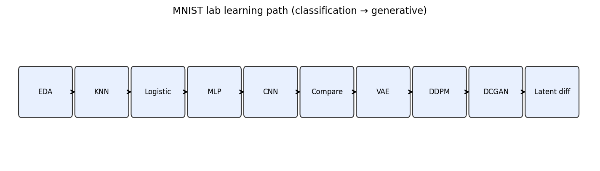

*Figure 1: Learning path I followed: EDA, manual classifiers, CNN, comparison, then generative models.*

Each notebook preserves embedded outputs so metrics and plots are inspectable without retraining. All figures in this report were copied from those outputs into `results/figures/`; I did not regenerate checkpoints from gitignored `training_results/` or `*.pth` files.

---

## 2. Exploratory data analysis

Before training anything, `eda_analysis.ipynb` loads MNIST and walks through class balance, per-digit galleries, mean templates, pixel variance maps, intensity histograms, and PCA structure. On visual inspection, the class counts are nearly even, which means raw accuracy is a reasonable metric and I do not need heavy rebalancing tricks for this dataset.

| Class balance | Mean digit templates |
|---------------|---------------------|
| 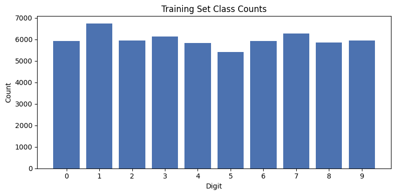 | 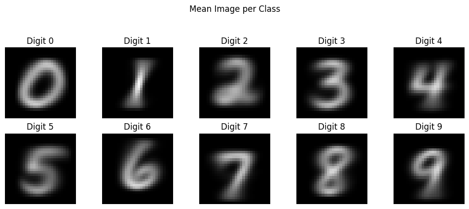 |

The mean images look like the digits I expect, but PCA plots show substantial overlap between classes in the first two components:

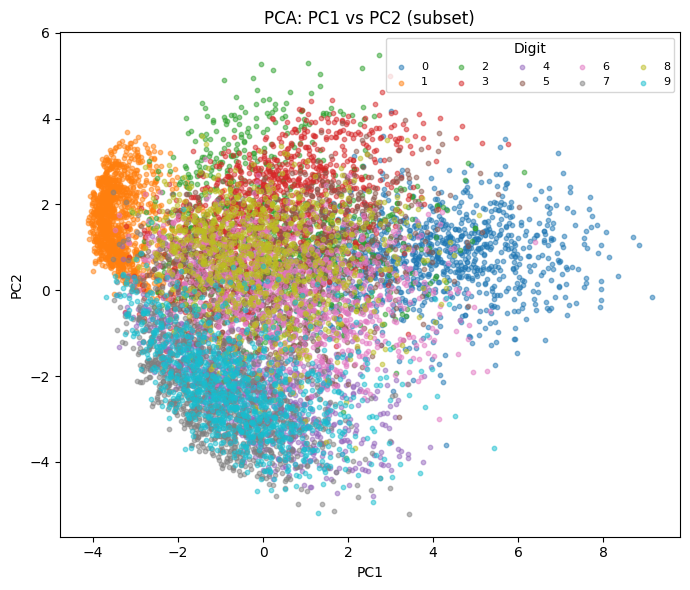

That overlap stuck with me. MNIST is often called "easy," yet a single linear boundary in pixel space still cannot separate all ten digits cleanly. I took that as early evidence that I would need non-linear models, which is exactly what the later notebooks tested.

---

## 3. Classical and manual machine learning

### 3.1 KNN and the bias-variance tradeoff

In `manual_knn.ipynb` I implemented KNN in NumPy and then batched it on GPU with `torch.cdist`. A sweep over k in {1, 3, 5, 9, 15, 20} shows accuracy peaking near k=3 at **0.9705** on the full test set:

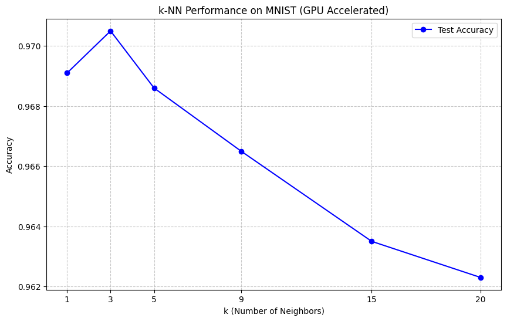

Very small k is noisier; very large k oversmooths decision boundaries. I learned that even on MNIST, KNN is a strong baseline if you can afford the distance computation, and that tuning k changes the kind of mistakes the model makes.

### 3.2 Logistic regression: a dip I did not expect

I expected accuracy to improve monotonically as models gained capacity. That did not happen. My from-scratch softmax regression in `manual_logistic_reg.ipynb` plateaus at **0.9241**, below KNN and well below the manual MLP. I think that is mostly a capacity issue: logistic regression is a linear classifier in pixel space, and MNIST digits written in different styles still overlap when flattened to 784 dimensions.

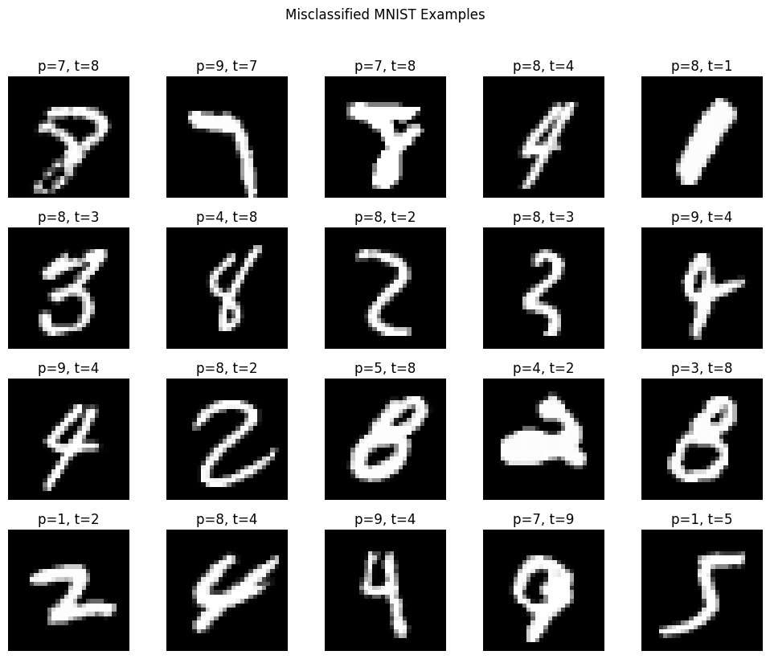

The lesson for me was blunt: more "math in the notebook" does not automatically beat a simple non-parametric method if the model class is too restrictive.

### 3.3 Manual MLP

Adding one ReLU hidden layer (H=128, 100 epochs) in `manual_mlp.ipynb` raised accuracy to **0.9794**. The first-layer weight templates look like crude stroke detectors:

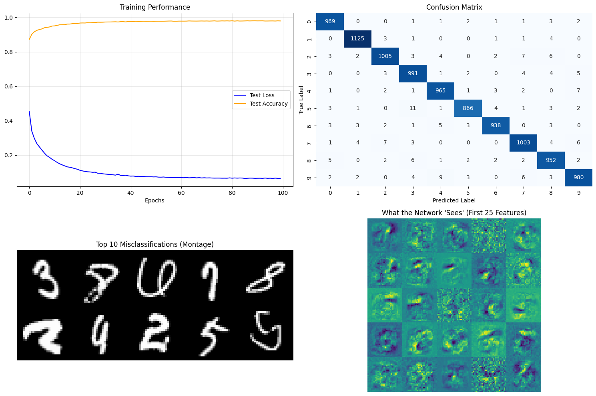

I learned that a single hidden layer is enough to recover most of the KNN gap, which helped me see MLPs as learned feature extractors rather than black boxes.

### Classification metrics (from `results/metrics/classification.json`)

| Model | Test accuracy | Source notebook |
|-------|---------------|-----------------|
| KNN (GPU, k=3) | 0.9705 | `manual_knn.ipynb` |
| Logistic regression | 0.9241 | `manual_logistic_reg.ipynb` |
| Manual MLP | 0.9794 | `manual_mlp.ipynb` |
| SimpleCNN | 0.9871 | `cnn.ipynb` |
| Comparison CNN | 0.9913 | `02_mnist_models.ipynb` |

---

## 4. CNN baseline

`cnn.ipynb` implements a small SimpleCNN trained five epochs with SGD. Test accuracy reaches **0.9871** by epoch 4. The jump from manual MLP to CNN is modest in absolute terms on MNIST, but I think the spatial inductive bias matters. Seeing the first-layer filters line up with coursework examples made the inductive-bias argument feel real rather than theoretical.

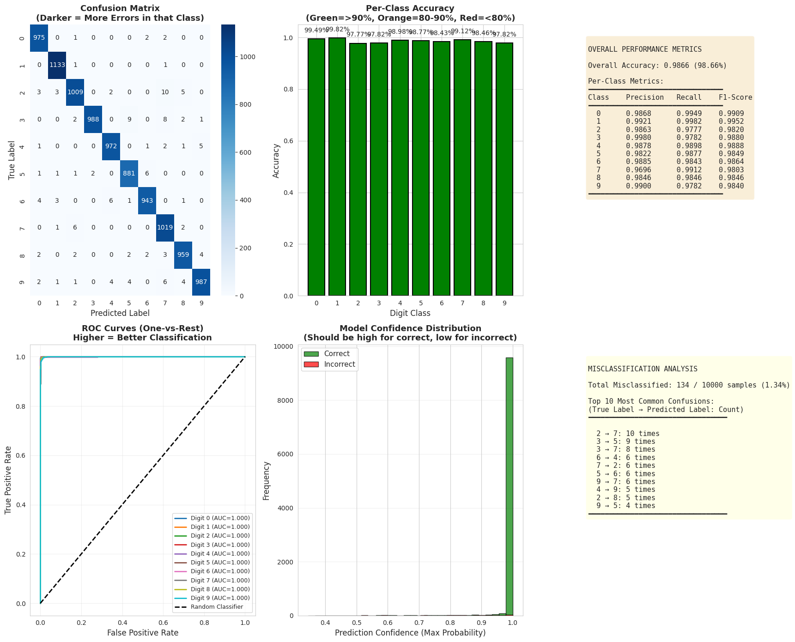

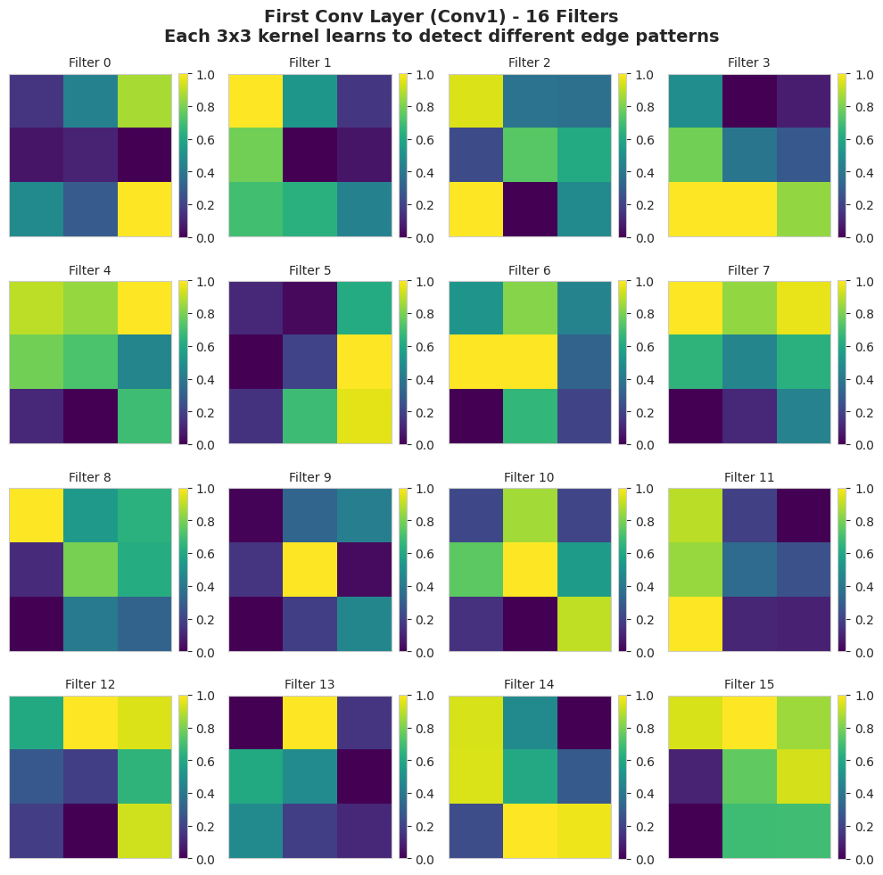

I learned to read confusion matrices as a story about remaining errors, not just a single accuracy number.

---

## 5. Generative models

After classification, I worked through four generative approaches. I did not run FID or IS; I judged samples by eye on the PNG grids in `results/figures/`. That is a weakness for claiming generative quality, but it forced me to look carefully at what each family actually outputs.

### 5.1 Variational autoencoder

`vae.ipynb` trains a 16-D VAE for 50 epochs. Final train/val loss: **100.22 / 100.09**. Reconstructions preserve digit identity but look soft. I learned that compression and sharpness pull in opposite directions: the VAE gives me a usable latent space, but I should not expect crisp samples from the decoder alone.

| Reconstructions | Training curves |
|-----------------|-----------------|
| 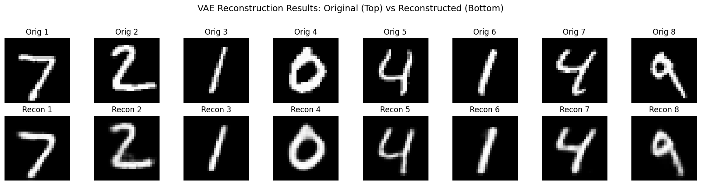 | 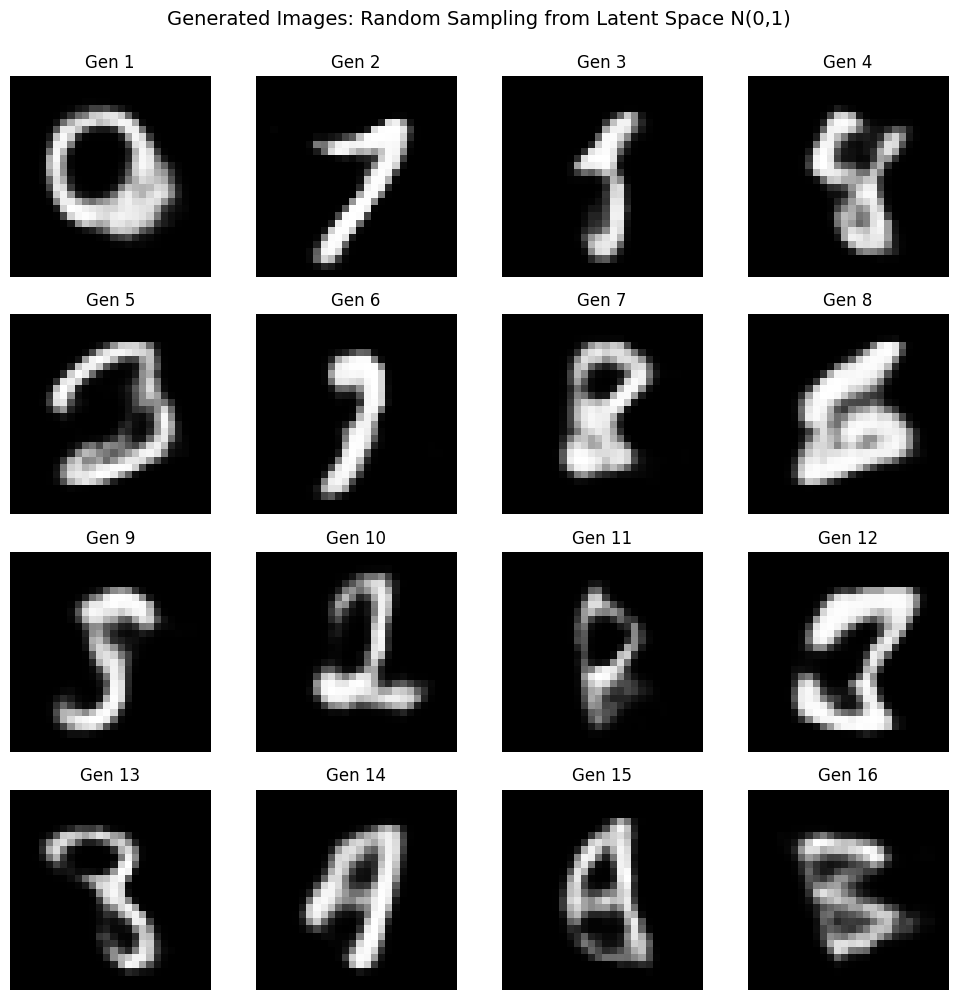 |

### 5.2 Pixel-space DDPM

`ddpm.ipynb`: T=300, 15 epochs, avg loss **0.0454** at epoch 15. I learned why latent diffusion exists: the math is elegant, but denoising every pixel step by step is expensive even on 28x28 images.

| Loss curve | Sample grid |
|------------|-------------|
| 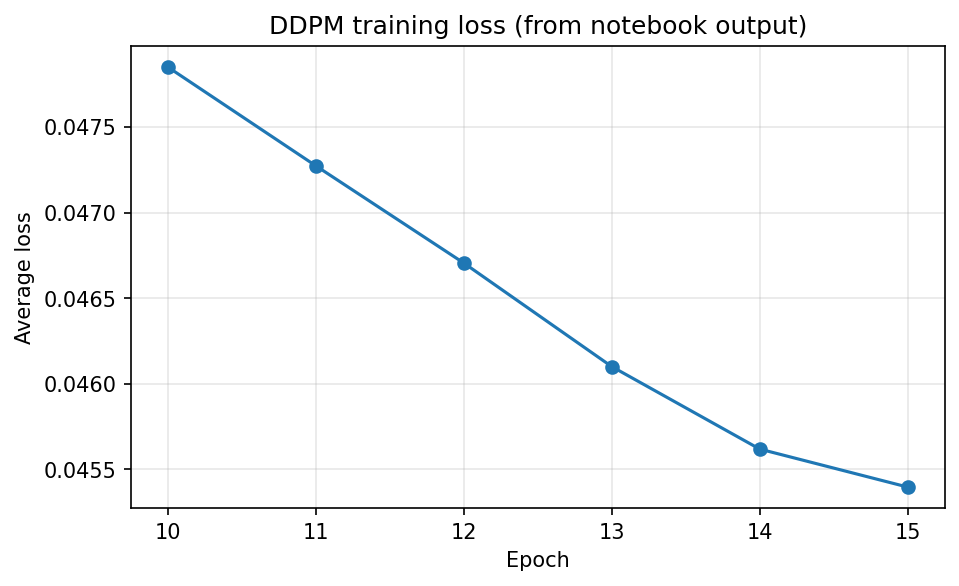 | 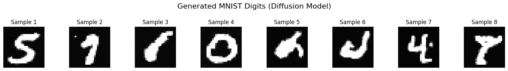 |

### 5.3 DCGAN

`dcgan.ipynb`: 50 epochs, G/D loss **3.41 / 0.32**. I would not call GAN training stable here, but the saved outputs are usable. I learned that adversarial training can produce sharper digits than my VAE decoder, at the cost of trickier optimization.

| Generated digits | Latent interpolation |
|------------------|---------------------|
| 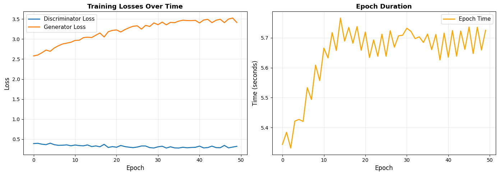 | 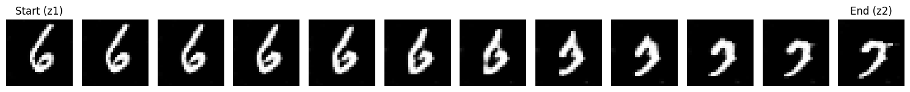 |

### 5.4 Latent diffusion MLP

The notebook `latent_diffusion_mlp.ipynb` trains VAE + `LatentDiffusionMLP` (MSE **0.224**). I learned that reusing the VAE idea across notebooks is convenient while learning, but duplicating training is poor engineering hygiene.

| VAE reconstructions | Diffusion samples |
|---------------------|-------------------|
| 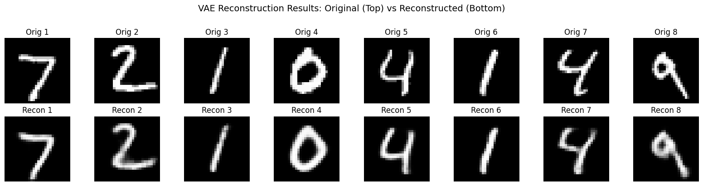 | 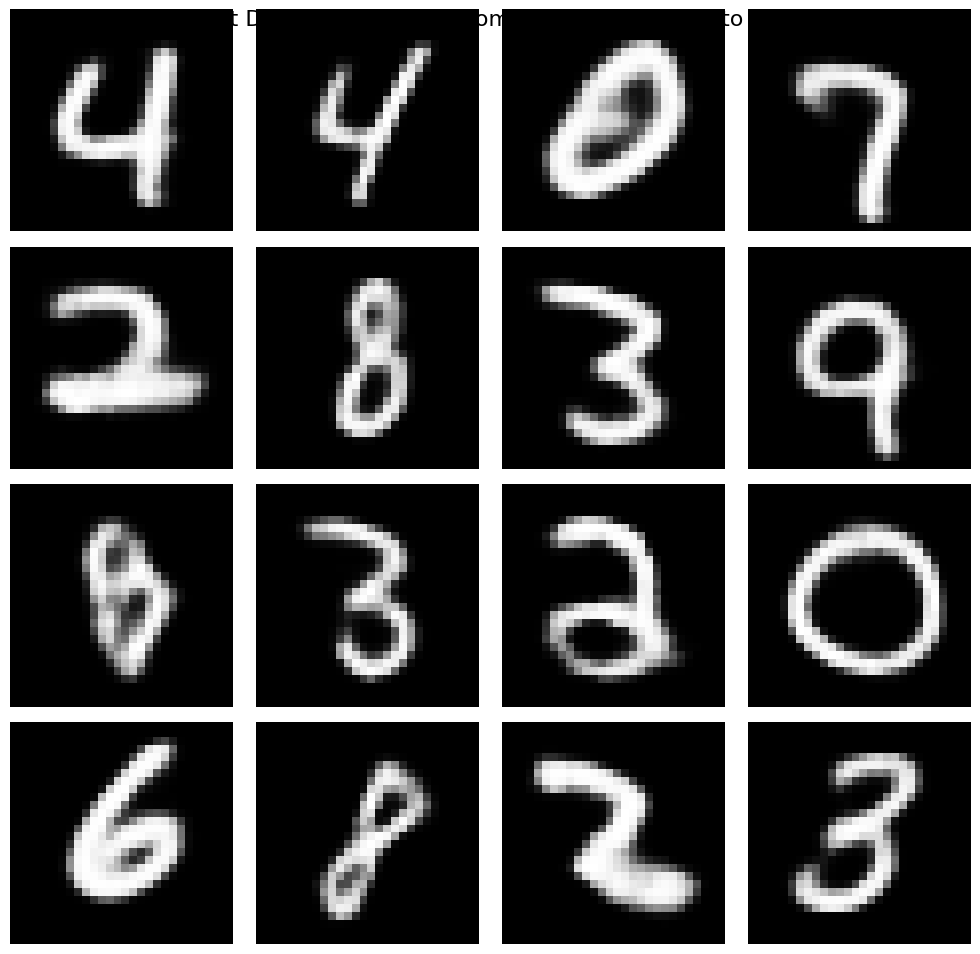 |

---

## 6. Comparison and insights

`02_mnist_models.ipynb` benchmarks models on a shared harness. The accuracy ladder and top CNN confusion pairs:

| Accuracy bar chart | Confusion pairs |
|--------------------|-----------------|
| 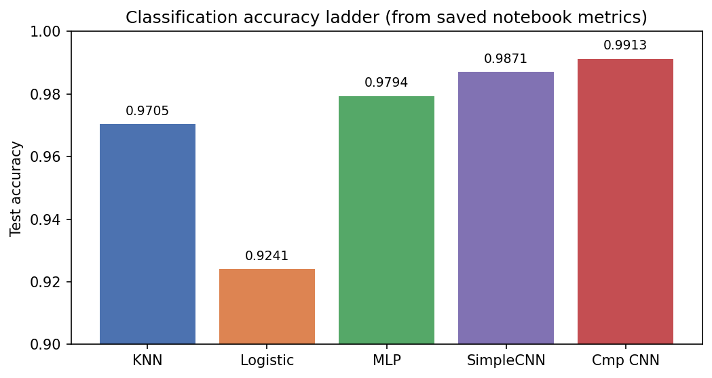 | 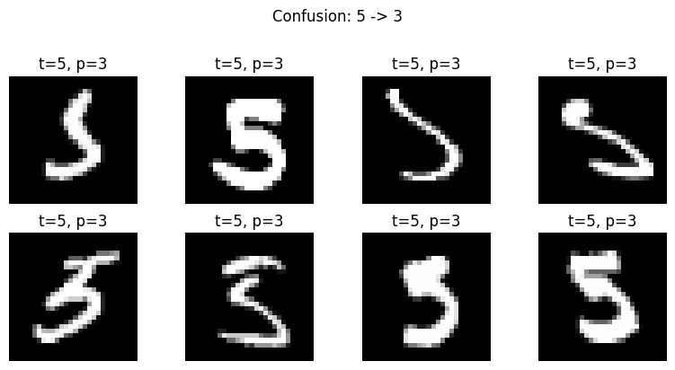 |

Deep learning wins on MNIST, but classical KNN is already strong. On the generative side, I now think of the tradeoffs this way: VAEs blur, pixel DDPMs are faithful but heavy, GANs can look sharp but need monitoring, and latent diffusion is efficient but inherits VAE quality. I did not run controlled ablations, so this is personal takeaway from the PNGs, not a benchmark result.

---

## 7. What I learned

Looking back at the full lab, a few lessons stand out:

- **Start with the data.** EDA took time, but it explained later failures (linear models struggling, confusion pairs that look like handwriting variation).
- **Implement before abstracting.** Manual KNN, logistic regression, and MLP code made later PyTorch models easier to reason about.
- **Accuracy ladders lie a little.** Logistic regression at 0.9241 is not a bug; it is a reminder that model class matters as much as tuning.
- **Generative models teach different skills.** VAEs taught compression and ELBO tradeoffs; DDPMs taught noise schedules; GANs taught unstable co-training; latent diffusion tied the threads together.
- **Document the rough edges.** Duplicate VAE training, unpinned dependencies, and missing FID scores are part of the honest story of how I built this repo.

---

## 8. Limitations

- **No FID / IS.** Qualitative generative evaluation only.
- **28x28 grayscale.** Not representative of real vision tasks.
- **Duplicate VAE training** across `vae.ipynb` and `latent_diffusion_mlp.ipynb`.
- **Duplicate CNN rows** possible in the comparison notebook. I cite **0.9913**.

---

## 9. Future work

- Deduplicate VAE pipeline (load checkpoint instead of retraining).
- Add FID or classifier-based generative scores.
- Guard Colab cells; dedupe VAE training across notebooks.
- Fashion-MNIST extension with the same structure.
- Optional `nbconvert` CI smoke test.

---

## Conclusion

I built an end-to-end MNIST lab that reads like a course project I actually ran. Classification reaches **0.9913** on the comparison CNN; generative models produce inspectable digit samples without me claiming state-of-the-art numbers. The part I am most glad I kept is the reflective thread: the logistic-regression dip, the soft VAE reconstructions, the heavy pixel DDPM, and the missing FID metrics. Those details explain what I learned, not just what I achieved.

---

## References

1. LeCun et al. (1998). Gradient-based learning applied to document recognition.  
2. Kingma and Welling (2014). Auto-Encoding Variational Bayes.  
3. Ho et al. (2020). Denoising Diffusion Probabilistic Models.  
4. Goodfellow et al. (2014). Generative Adversarial Nets.  
5. Radford et al. (2016). DCGAN.
